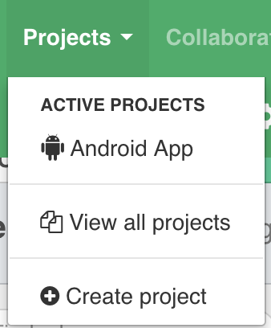

# OneSkyApp - Android - Pull Translations Step

Pull Android translations from OneSkyApp.

## How to use this Step

Can be run directly with the [bitrise CLI](https://github.com/bitrise-io/bitrise),
just `git clone` this repository, `cd` into it's folder in your Terminal/Command Line
and call `bitrise run test`.

*Check the `bitrise.yml` file for required inputs which have to be
added to your `.bitrise.secrets.yml` file!*

Credentials can be found at your url: https://your-slug.oneskyapp.com/admin/site/settings

- Get `ONESKYAPP_SECRET_KEY` from `Secret Key` field
- Get `ONESKYAPP_PUBLIC_KEY` from `Public Key` field

Click on one of project in the list and copy project id in the URL.

