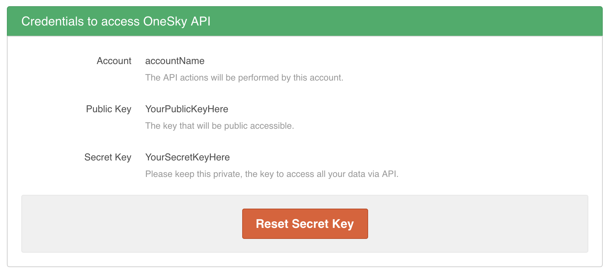
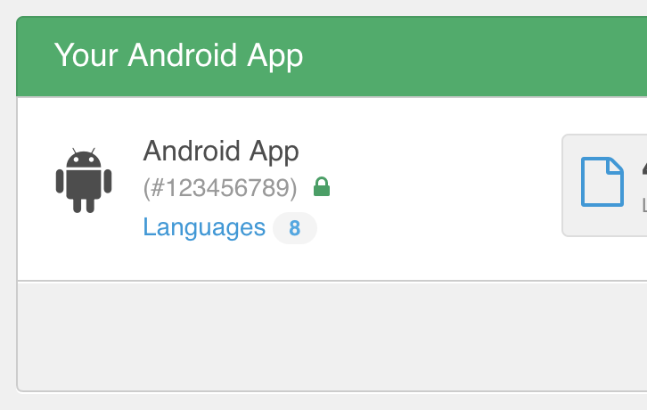

# OneSkyApp - Android - Pull Translations Step

Pull Android translations from OneSkyApp.

## How to use this Step

Credentials can be found at your url: https://YOUR_SLUG.oneskyapp.com/admin/site/settings

- Get `ONESKYAPP_SECRET_KEY` from `Secret Key` field
- Get `ONESKYAPP_PUBLIC_KEY` from `Public Key` field

Click on one of project in the list and copy project id in the URL.

Project id can be found at your url: https://YOUR_SLUG.oneskyapp.com/admin/projects

Get `ONESKYAPP_APP_ID` from the value in parenthesis and without the hashtag. Here: `123456789`
